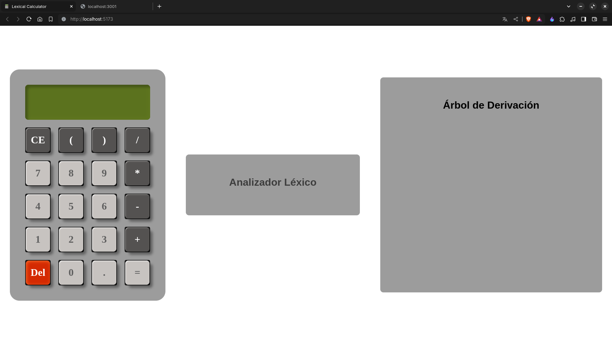
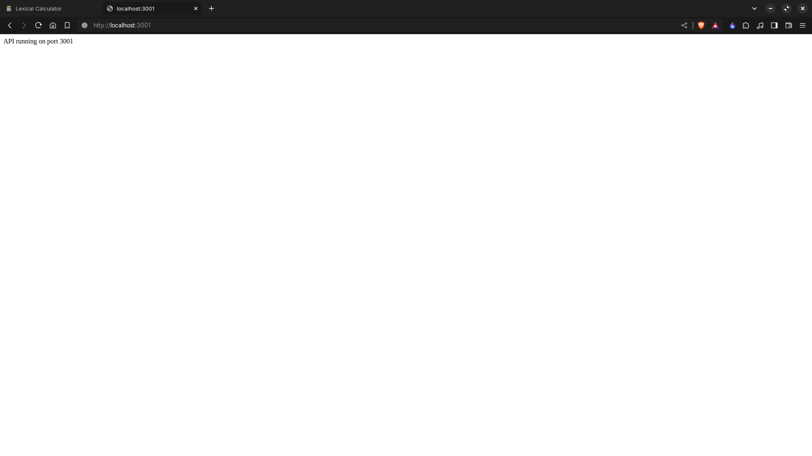
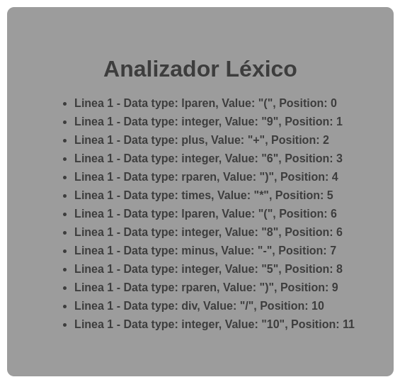
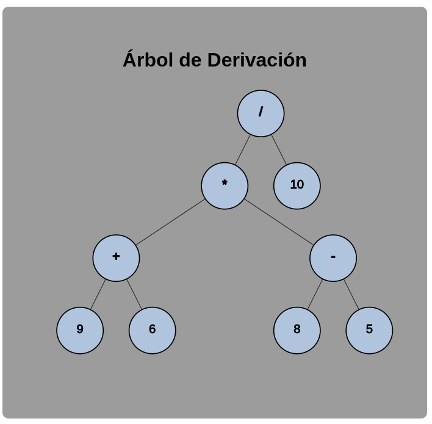
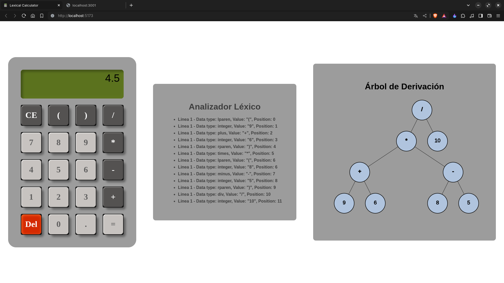

# Calculadora Web con Análisis Léxico y Árbol de Derivación

Este proyecto es una calculadora web que no solo resuelve expresiones matemáticas, sino que también realiza un análisis léxico y genera un árbol de derivación para expresiones ingresadas. Está desarrollado en JavaScript utilizando la librería React para el front-end y Express para el back-end.

## Funcionalidades Destacadas

- Resolución de expresiones matemáticas.
- Análisis léxico de las expresiones ingresadas.
- Generación de árbol de derivación para visualizar la estructura de las expresiones.
- Interfaz de usuario intuitiva y receptiva desarrollada con React.
- Servidor back-end implementado con Express para gestionar las solicitudes.

## Tecnologías Utilizadas

- JavaScript
- React
- Vite
- Node.js
- Express

## Instalación y Ejecución

1. Clona este repositorio en tu máquina local.
2. Navega a la carpeta del proyecto.
3. Instala las dependencias del front-end:

    ```bash
    cd Calculator-Web-Lexical-Derivation-Tree
    npm install
    ```

4. Instala las dependencias del back-end:

    ```bash
    cd Calculator-Web-Lexical-Derivation-Tree/API
    npm install
    ```

5. Inicia el servidor de desarrollo:

    ```bash
    npm run dev
    ```

6. Abre tu navegador y visita `http://localhost:5173/` para ver la aplicación front end en funcionamiento y
 `http://localhost:3001/` para ver tu servidor back end en funcionamiento.


## Ejemplos de Uso

1. Ingresa una expresión matemática en la calculadora web.
2. Observa la resolución de la expresión, el análisis léxico y el árbol de derivación generados.

## Capturas de pantalla

Aquí hay algunas capturas de pantalla de la aplicación en funcionamiento:









## Contribuciones y Colaboración

¡Gracias por tu interés en contribuir! Si deseas contribuir a este proyecto, sigue estos pasos:

1. Haz un fork del repositorio.
2. Crea una rama nueva con tu funcionalidad o corrección de errores: `git checkout -b mi-funcionalidad`.
3. Realiza tus cambios y haz commit: `git commit -m 'Agrega mi funcionalidad'`.
4. Sube tus cambios a tu repositorio en GitHub: `git push origin mi-funcionalidad`.
5. Envía un pull request para que revisemos tus cambios.

Por favor, asegúrate de seguir nuestras pautas de contribución. ¡Esperamos tus contribuciones!

## Licencia

Este proyecto está bajo la Licencia [MIT](LICENSE).
